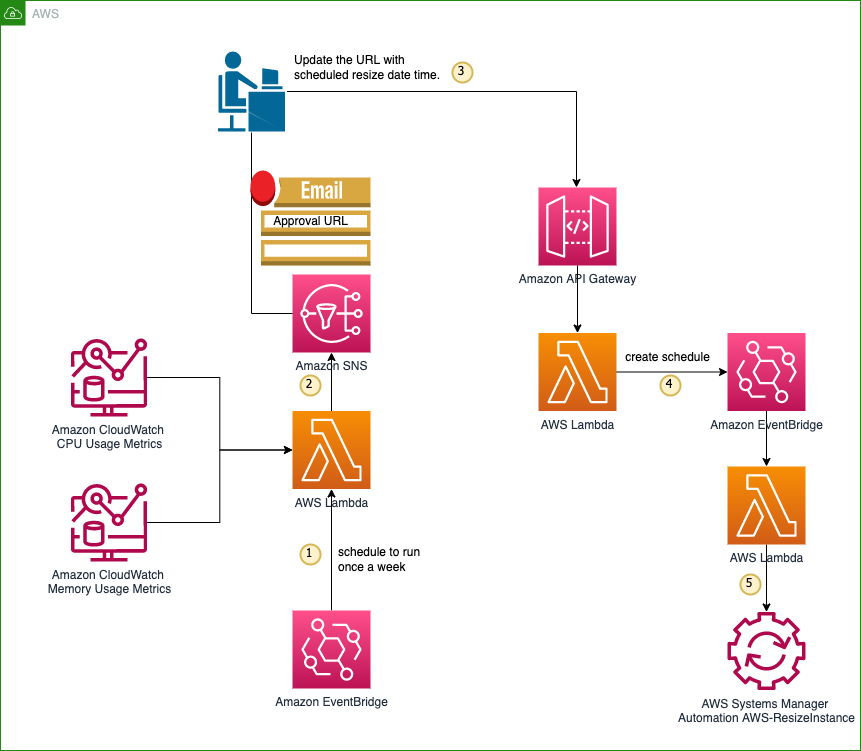
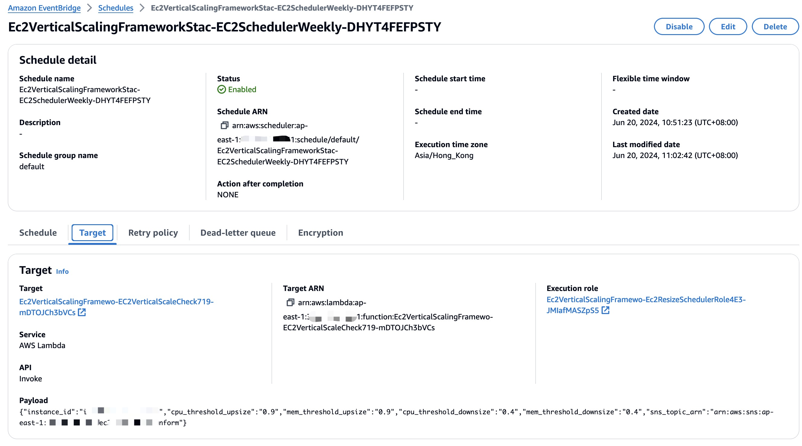
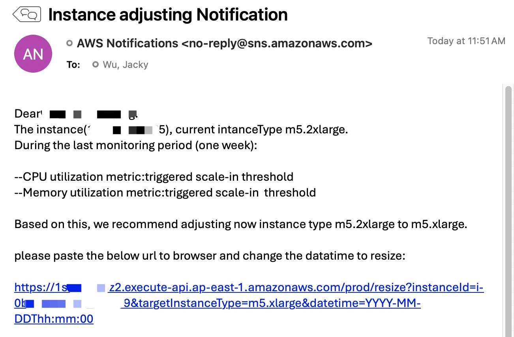
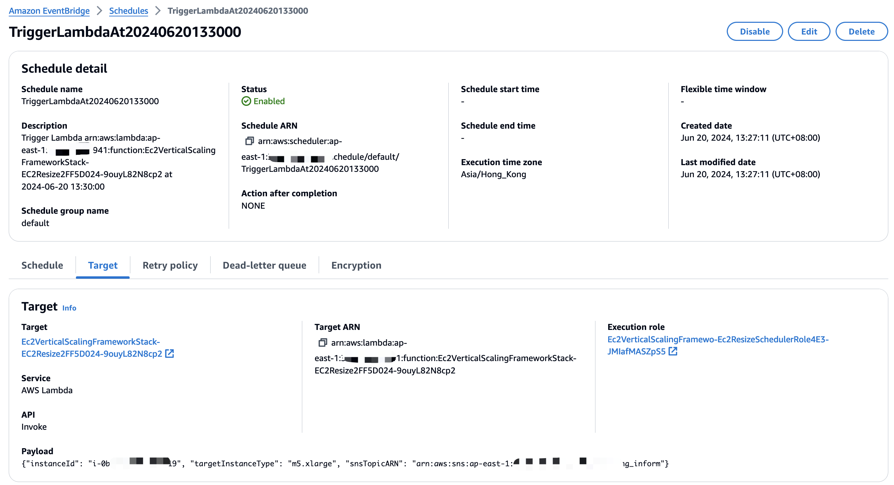

# Welcome to EC2 vertical scaling framework

Modern applications typically use horizontal scaling on the cloud to handle traffic fluctuations, such as using Auto Scaling Groups (ASG) on AWS EC2. However, some applications still need to be deployed on a single machine due to special requirements or pending modernization efforts. When traffic changes, these applications can only perform vertical scaling, which means increasing or decreasing the computing resources of a single machine. For example, to ensure fairness, some trading matching engines typically run on a single machine. Additionally, some legacy applications that have not yet been modernized can only run on a single machine before the modernization is complete. To better leverage the elasticity and automation capabilities of cloud services, vertical scaling is essential, allowing these applications to dynamically adjust resources based on actual needs and improve cost-effectiveness.

This framework provides a prototyping to implement automated elastic vertical scaling for AWS EC2 instances, enabling applications deployed on a single machine to enjoy the flexibility and cost-effectiveness of cloud resources. Through automated vertical scaling, you can dynamically adjust the computing resources of a single EC2 instance based on the actual needs of your application, optimizing resource utilization and cost-effectiveness.

## Prerequisite

We assume that 
* you should already install CloudWatch agent on your EC2, so that we could featch the mem_used_percent metric in CloudWatch for scaling decision making. 
* we'll use private API gateway. You should already have a VPC endpoint for API Gateway in your VPC. 
* we'll send EC2 vertifical scaling notification to a SNS topic. You should aleady have an SNS topic to receive notification. Please put the SNS topic ARN into the context in the cdk.json file. 


## Architecture

You can find the framework architecture as below.


The following are the data flow of the EC2 instance auto-scaling solution:

1. Amazon EventBridge: Triggers AWS Lambda functions based on scheduled CPU utilization events, enabling usage tracking and scaling actions.

2. AWS Lambda: Uses the CloudWatch API to retrieve EC2 instance metrics, such as CPU utilization and memory usage. It is triggered based on a specific event and sends notifications to SNS.

3. Amazon SNS: Delivers notifications to users, allowing them to track scaling activities at specific time intervals.

4. Amazon API Gateway and AWS Lambda: API Gateway receives scaling requests, which then invoke AWS Lambda functions to perform scheduled scaling actions.

5. AWS Systems Manager: Used for resize the EC2 instance.

## Key components
Here are the introduction of key components.

### Amazon CloudWatch 
CloudWatch is an excellent monitoring tool for AWS EC2 instances. It allows you to view the CPU utilization for each EC2 instance. If you have installed the CloudWatch Agent on your EC2 instances, you can also publish metrics such as memory and disk utilization to CloudWatch for monitoring. 

Here is an example of monitoring EC2 CPU and memory usage to determine whether to scale resources up or down based on certain threshold.

Scaling Metric | Metric Name | Action Logic
--- | --- | ---
CPU Scaling Down | cpuutilization | If the average CPU utilization over a 7-day period is below a certain low threshold, it is considered a candidate for scaling down CPU resources.
Memory Scaling Down | mem_used_percent | If the average memory utilization over a 7-day period is below a certain low threshold, it is considered a candidate for scaling down memory resources.
CPU Scaling Up | cpuutilization | If there are 5 instances within a 7-day period where the CPU utilization exceeds a certain high threshold, it is considered a candidate for scaling up CPU resources.
Memory Scaling Up | mem_used_percent | If there are 5 instances within a 7-day period where the memory utilization exceeds a certain high threshold, it is considered a candidate for scaling up memory resources.

### Amazon EC2 Instance Size
For AWS EC2 instances, different use cases may require different instance families. You can choose from various instance families, such as the general-purpose M series, the compute-optimized C series, and the memory-optimized R series.
• The M series instances have vCPU and memory ratios of 1 vCPU for every 4GB of memory, suitable for general-purpose workloads.
• The C series instances have vCPU and memory ratios of 1 vCPU for every 2GB of memory, suitable for compute-intensive workloads.
• The R series instances have vCPU and memory ratios of 1 vCPU for every 8GB of memory, suitable for memory-intensive applications.
For more details, visit: https://aws.amazon.com/ec2/instance-types/

The following table outlines some guidelines for selecting CPU and memory configurations when there are needs to scale up/down CPU and memory:

CPU/Memory Scaling | Memory Scaling Down | Memory No Change | Memory Scaling Up
--- | --- | --- | ---
CPU Scaling Down | Same series, smaller size | No change for R series; M to R series; C to M series | Larger size for R; M to R series; C to M series
CPU No Change | R to M series; M to C series; No change for C series | Keep current | Larger size for R series; M to R series; C to M series
CPU Scaling Up | R to M series; M to C series; Larger size for C series | R to M series; M to C series; Larger size for C series | Same series, larger size

### API Gateway
For security purpose, we use private API gateway here, so that only your company intranet could trigger the EC2 resize. You need to Create a VPC endpoint for API Gateway in your VPC to access the API gateway. Please refer more: https://docs.aws.amazon.com/apigateway/latest/developerguide/apigateway-private-api-create.html. 


## Getting Started

After download the code, you should update following parameters in the context in the cdk.json file, such as:
```
"context": {
  "instance_id": "i-ec20987654321",
  "cpu_threshold_upsize": "0.9",
  "mem_threshold_upsize": "0.9",
  "cpu_threshold_downsize": "0.4",
  "mem_threshold_downsize": "0.4",
  "sns_topic_arn": "arn:aws:sns:ap-east-1:123456789012:ec2_notification_topic",
  "resize_time_zone": "Asia/Hong_Kong"
}
```

Then you can run `cdk` commands to deploy the framework:
```
python3 -m venv .venv
source .venv/bin/activate
python3 -m pip install --upgrade pip
pip3 install -r requirements.txt
cdk bootstrap
cdk deploy
```

After deployment, you will create a weekly scheduler to check EC2 usage.


If there is any scaling up/down detected, it will send out email as below. You can change the email template in the Lambda function [ec2-vertical-scale-check.py](ec2_vertical_scaling_framework/lambda/ec2-check/ec2-vertical-scale-check.py)


You can update the datetime `YYYY-MM-DDThh:mm:00` of the URL in the email, and run it in your browser. Suppose the browser is in intranet and can reach the private API Gateway.
```
https://abcdefg.execute-api.ap-east-1.amazonaws.com/prod/resize?instanceId=i-123456789012&targetInstanceType=m5.xlarge&datetime=YYYY-MM-DDThh:mm:00
```

The Lambda behind the API Gateway will create a scheduler according to the datetime `YYYY-MM-DDThh:mm:00`. Following is the example of setting to the datetime `2024-06-20T13:30:00`. Then at `2024-06-20T13:30:00`, the EC2 will be resized to the target size `m5.xlarge`.



## Clean up

If you want to delete all stacks created by this CDK app, you can delete the stack `Ec2VerticalScalingFrameworkStack` in CloudFormation or run the command below:
```
cdk destroy Ec2VerticalScalingFrameworkStack
```


## Notes

* We only check one EC2 instance in the framework. You can adjust the code to check a group of EC2 instances.

* this is only a prototyping. If you want to make it production, you need to consider the situation such as the resize schedule URL is triggered multiple times with different datetime, how do you avoid resizing duplicately.

* Please adjust and use least priviledge in the IAM role permissions.

## Security

See [CONTRIBUTING](CONTRIBUTING.md#security-issue-notifications) for more information.

## License

This library is licensed under the MIT-0 License. See the LICENSE file.


Enjoy!
